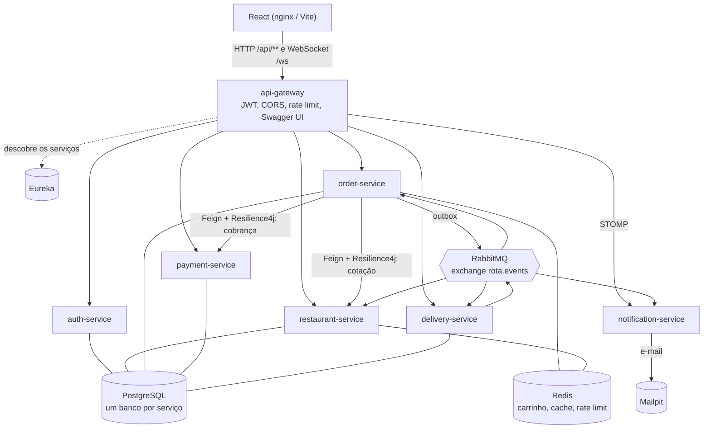
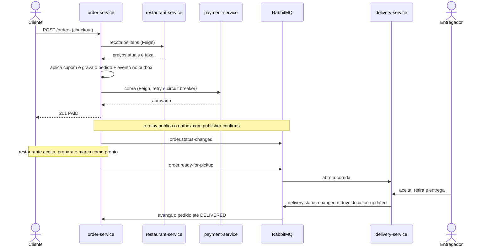
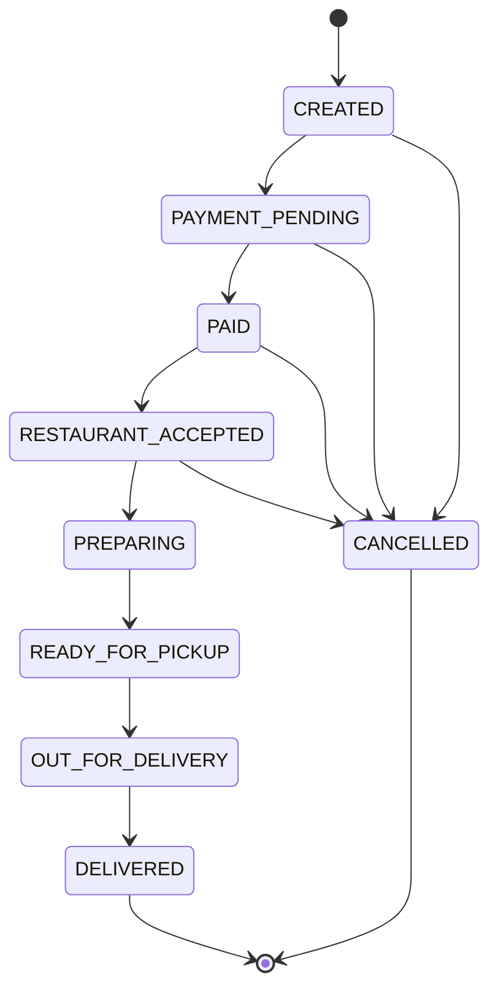

# Rota

Plataforma de delivery construída com arquitetura de microsserviços — projeto de portfólio fullstack.

## Stack

| Área | Tecnologia |
|---|---|
| Backend | Java 21, Spring Boot 3, Spring Security + JWT, Spring Data JPA |
| Arquitetura | Spring Cloud Gateway, Eureka, OpenFeign, Resilience4j |
| Dados | PostgreSQL (database per service), Flyway, Redis |
| Mensageria | RabbitMQ |
| Tempo real | Spring WebSocket (STOMP) |
| Frontend | React, TypeScript, Vite, TanStack Query, Zustand, Tailwind |
| Observabilidade | Actuator, Prometheus, Grafana, OpenTelemetry |
| Testes | JUnit 5, Mockito, Testcontainers |
| DevOps | Docker, Docker Compose, GitHub Actions |

## Usuários

- Cliente
- Restaurante
- Entregador
- Administrador

## Estrutura

```
backend/
  common/               exceções, JWT, eventos, outbox e filas compartilhados
  discovery-server/     registro de serviços (Eureka)                  :8761
  api-gateway/          entrada única: rotas, JWT, CORS e rate limit   :8080
  auth-service/         cadastro, login, JWT e refresh token           :8181  auth_db
  restaurant-service/   restaurantes, cardápio, cotação (cache Redis)  :8182  restaurant_db
  order-service/        carrinho (Redis), pedidos, cupons e avaliações :8183  order_db
  payment-service/      pagamentos (Strategy: fake e dinheiro)         :8184  payment_db
  delivery-service/     entregadores e corridas                        :8185  delivery_db
  notification-service/ e-mails e WebSocket (STOMP)                    :8186
frontend/               aplicação React (nginx no compose)             :5173 dev / :4173
infra/                  init dos bancos, Prometheus (scrape e alertas), Grafana (painéis)
.github/workflows/      CI: testes, build do front e das imagens
```

Cada serviço segue a mesma organização em camadas:

```
interfaces/rest     controllers e DTOs
application         casos de uso e portas (interfaces para outros serviços)
domain              entidades, regras de negócio e repositórios
infrastructure      configuração, clientes HTTP, persistência externa
```

## Executando

Pré-requisito: Docker. Tudo compila dentro dos containers, então JDK e Node locais são opcionais.

```bash
docker compose up -d --build     # infraestrutura, serviços, front e observabilidade
```

Para desenvolver o front com hot reload (Node 18+):

```bash
cd frontend
npm install
npm run dev                      # http://localhost:5173 (chama o gateway em :8080)
```

| Painel | Endereço |
|---|---|
| Aplicação (build no nginx) | http://localhost:4173 |
| Aplicação (Vite, dev) | http://localhost:5173 |
| API Gateway | http://localhost:8080/api/... |
| Eureka | http://localhost:8761 |
| RabbitMQ (rota / rota) | http://localhost:15672 |
| E-mails de teste (Mailpit) | http://localhost:8025 |
| Grafana (rota / rota) | http://localhost:3000 |
| Prometheus | http://localhost:9090 |
| Jaeger | http://localhost:16686 |

Os serviços Java têm limite de 448 MB cada no compose; a stack inteira usa cerca de 3,5 GB.

Contas de demonstração (senha `rota12345`):

| E-mail | Perfil |
|---|---|
| cliente@rota.dev | Cliente |
| restaurante@rota.dev | Restaurante (dono dos restaurantes de exemplo) |
| entregador@rota.dev | Entregador |
| admin@rota.dev | Administrador |

Para testar:

- **Cliente**: cupons `SAVE10` (10%, mín. R$ 50), `BEMVINDO` (R$ 15, mín. R$ 40) e `PIZZA20` (só no Forno da Nonna).
- **Pagamento fake**: Pix sempre aprovado; cartão recusado acima de R$ 500; dinheiro é confirmado na hora.
- **Restaurante**: em `/partner`, aceite o pedido, inicie o preparo e marque como pronto. Isso abre a corrida.
- **Entregador**: em `/driver`, fique online, use a posição de demonstração e aceite a entrega.
- **Tempo real**: abra o pedido como cliente em uma janela e o painel do restaurante ou do entregador em
  outra (janela anônima). Status, avisos e a posição do entregador no mapa mudam sem recarregar.
- **E-mails**: pagamento aprovado, saída para entrega, entrega e cancelamento chegam no Mailpit.
- **Administração**: em `/admin`, os números do dia da plataforma, todos os pedidos, cupons (criar,
  ativar e desativar) e usuários (buscar e bloquear). Uma conta bloqueada perde a sessão e não entra mais.

## Documentação da API

Swagger UI único no gateway: http://localhost:8080/swagger-ui.html. Um seletor troca entre os serviços.
Faça login em `POST /auth/login` (auth-service), clique em **Authorize** e cole o `accessToken`.
O "Try it out" passa pelo gateway, com as mesmas rotas, filtros e rate limit que o front usa.

## Testes

```bash
./backend/mvn-docker.sh test      # unitários (rápidos, sem Docker)
./backend/mvn-docker.sh verify    # unitários + integração com Testcontainers
cd frontend && npm test           # front (Vitest)
```

- **Unitários** (JUnit 5, Mockito, AssertJ): máquina de estados, cupons, carrinho, políticas de acesso,
  outbox, resiliência do cliente de pagamento e autoconfigurações do `common`.
- **Integração** (`*IT`, Testcontainers): sobem o serviço inteiro contra **Postgres, Redis e RabbitMQ reais**.
  Só as chamadas a outros serviços são dublês.
  - `OrderFlowIT`: carrinho, cupom, checkout, pagamento, avanço pelo restaurante e os eventos que o outbox
    publica no RabbitMQ, na ordem certa. Também cobre o pagamento fora do ar e pago depois, e a transição
    inválida respondendo 409.
  - `CouponUsageIT`: 20 checkouts simultâneos não passam do limite de uso do cupom.
  - `AuthFlowIT`: cadastro, login, rotação de refresh token com detecção de reuso e bloqueio de conta.
- O CI roda tudo isso a cada push.

## Arquitetura



Só duas chamadas continuam síncronas, porque o usuário espera a resposta: a **cotação** no catálogo
e a **cobrança** no pagamento. As duas passam por OpenFeign com timeout, retry com backoff e circuit breaker.
O resto da integração é por eventos:

| Evento | Publicado por | Consumido por |
|---|---|---|
| `order.status-changed` | order-service | notification (e-mail e WebSocket) |
| `order.ready-for-pickup` | order-service | delivery-service (abre a corrida) |
| `delivery.status-changed` | delivery-service | order-service (entregador, saiu, entregue), notification |
| `driver.location-updated` | delivery-service | notification (posição ao vivo para o cliente) |
| `review.created` | order-service | restaurant-service (média de avaliações) |

## Fluxo de um pedido



A máquina de estados do pedido (`OrderStatus`) aceita só estas transições; qualquer outra responde 409:



## Destaques

- **Máquina de estados do pedido** (`OrderStatus`): só transições válidas são aceitas; as demais retornam 409.
- **Auditoria**: cada transição é registrada em `order_history` com usuário, horário e motivo.
- **Preço sempre vem do catálogo**: carrinho e checkout recotam os itens no restaurant-service; valores enviados pelo cliente são ignorados.
- **Refresh token com rotação** e detecção de reuso (revoga todas as sessões do usuário).
- **Autorização por perfil e por dono**: restaurante só vê e altera pedidos do próprio restaurante; cliente só cancela antes do aceite.
- **Pagamento com Strategy**: `PaymentProvider` com implementações trocáveis por configuração; cobrança idempotente por pedido.
- **Cupons**: validade, pedido mínimo, teto de desconto, limite de uso com incremento atômico e restrição por restaurante.
- **Entregas**: busca por entregadores próximos com Haversine, aceite concorrente protegido por lock otimista.
- **Transactional Outbox**: o evento é gravado na mesma transação da mudança e publicado por um relay
  com publisher confirms. Um pedido feito com o RabbitMQ fora do ar não perde nenhum evento.
- **Consumidores idempotentes e DLQ**: cada evento tem um `eventId`; reentregas são descartadas
  (`processed_events` ou `SET NX` no Redis). Após 4 tentativas com backoff, a mensagem vai para `<fila>.dlq`.
- **Domain events**: toda mudança de status do `Order` registra um evento de domínio, publicado pelo
  Spring Data ao salvar; nenhum caminho de código consegue mudar o status sem notificar.
- **Resiliência**: com o payment-service fora, o circuito abre após falhas seguidas, o checkout responde
  na hora e o pedido fica aguardando pagamento até o serviço voltar.
- **Cache transacional**: busca e detalhe de restaurantes no Redis, invalidados só depois do commit.
- **Gateway**: rejeita token inválido antes de chegar aos serviços, bloqueia `/internal/**` e limita
  o login a 10 tentativas seguidas por IP.
- **WebSocket autenticado**: JWT no frame CONNECT; cada usuário só assina a própria fila, e só entregadores
  assinam o tópico de corridas.

## Produção e observabilidade

- **Imagens**: um Dockerfile multi-stage para todos os serviços Java (`--build-arg MODULE=...`). Ele compila
  só o módulo pedido, separa o jar nas camadas do Spring Boot e roda numa JRE Alpine com usuário sem
  privilégios. Uma mudança no código troca só a última camada.
- **Front**: build do Vite servido pelo nginx, que repassa `/api` e `/ws` para o gateway. Assim o navegador
  fala com uma origem só, como no dev.
- **Healthchecks**: cada serviço espera as dependências ficarem saudáveis (`/actuator/health`) antes de subir.
- **Métricas**: todos os serviços expõem `/actuator/prometheus`. O Prometheus descobre os alvos pelo Eureka,
  então um serviço novo entra no scrape sem configuração. Além das métricas de HTTP e JVM, há métricas de
  negócio: pedidos por status, valor pago e eventos pendentes no outbox.
- **Painel no Grafana** (provisionado, abre na home): serviços no ar, tráfego, latência p95, erros, pedidos,
  faturamento, ticket médio, filas, circuit breakers e JVM. Os pontos de latência trazem o `trace_id` e
  levam direto ao trace no Jaeger.
- **Alertas**: serviço fora ou sumido do Eureka, taxa de erros alta, circuito aberto, outbox acumulando e
  falhas ao consumir eventos.
- **Tracing distribuído** com OpenTelemetry: um pedido aparece como um trace só no Jaeger, do gateway aos
  serviços, passando por Feign, pelo outbox e pelo RabbitMQ até os consumidores.
- **CI** (GitHub Actions): `mvn verify` no backend e lint, testes e build no front, em paralelo. Depois o
  build das 9 imagens Docker em matriz, com cache, e a validação do `docker-compose.yml`.

## Roadmap

- [x] Fase 1 — MVP: Auth, Restaurant, Product, Cart, Order
- [x] Fase 2 — Negócio: Payment, Coupon, Rating, Delivery
- [x] Fase 3 — Distribuído: RabbitMQ, Redis, WebSocket, Gateway, Eureka, Resilience4j
- [x] Fase 4 — Produção: Docker, CI/CD, Prometheus, Grafana, OpenTelemetry
- [x] Fase 5 — Qualidade: testes unitários e de integração, segurança, documentação
